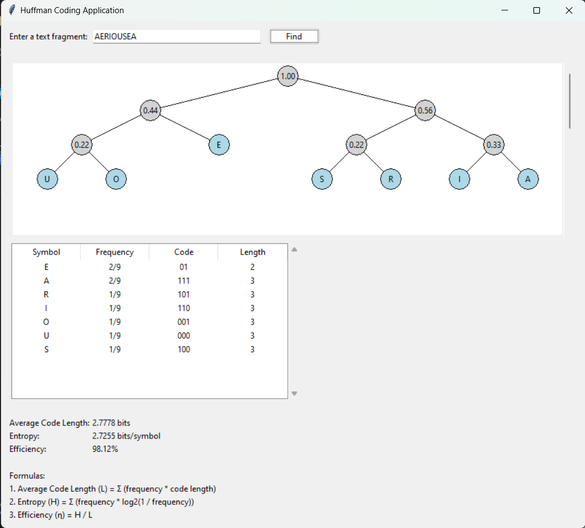

# Huffman Coding

## Overview

Huffman coding is a popular algorithm used for lossless data compression. It is widely used in various file compression formats such as `.zip`, `.png`, and `.mp3`. The algorithm assigns variable-length codes to input characters based on their frequencies. More frequent characters get shorter codes, while less frequent characters get longer codes, optimizing the storage and transmission of data.

The process of building the Huffman tree involves:
1. Constructing a frequency table for the characters in the input data.
2. Using the table to build a binary tree, where each leaf node represents a character and its frequency.
3. Traversing the tree to assign binary codes to each character.
4. Calculating the average code length, entropy, and efficiency of the generated Huffman codes.

## Project Overview

This project implements the Huffman coding algorithm in Python. It allows users to input a string (e.g., a name) and computes the corresponding Huffman codes. The project also calculates and displays key metrics such as the average code length, entropy, and efficiency of the generated codes.

### Features:
- **Huffman Code Generation**: Given a string, the project generates Huffman codes based on the frequency of each character.
- **Metrics Calculation**: It calculates:
  - Average code length (the weighted average of the lengths of the Huffman codes).
  - Entropy (a measure of the information content of the source).
  - Efficiency (the ratio of entropy to average code length).
- **Output Formatting**: The results are displayed in a formatted table, with the Huffman codes sorted by code length (ascending) and frequency (descending).
- **Sample Output**: The project also includes a sample output that demonstrates the process and results for a given input.

## Project Structure

This project an extended project from part A. The part A to calculate the huffman by tradional method.


## Sample Output and Reference

A sample output from the program is shown below, demonstrating the Huffman coding process for the input string "AERIOUSEA":




## How to Run the Project

1. Clone this repository:

    ```bash
    git clone https://github.com/errysyzwn/huffman-coding.git
    ```

2. Navigate into the project directory:

    ```bash
    cd huffman-coding
    ```

3. Run the Python script:

    ```bash
    python huffman-code.py
    ```

4. Enter a string when prompted, and the program will output the Huffman codes, as well as the average code length, entropy, and efficiency.

## How it Works

The program is structured as follows:
1. **Input**: A string (e.g., a name or any text).
2. **Frequency Calculation**: The program calculates the frequency of each character in the string.
3. **Huffman Tree Construction**: A priority queue is used to build the Huffman tree.
4. **Code Generation**: The tree is traversed to assign binary codes to each character.
5. **Metrics Calculation**: The program calculates average code length, entropy, and efficiency.
6. **Output**: The program displays the results in a formatted table and provides the calculated metrics.