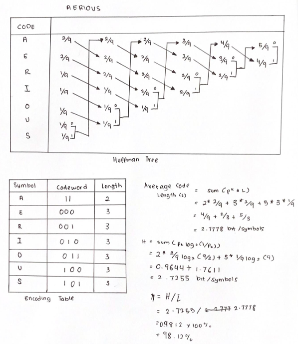

# Huffman Coding

## Overview

Huffman coding is a widely used algorithm for lossless data compression. It assigns variable-length binary codes to characters based on their frequencies. Frequently occurring characters are assigned shorter codes, while less frequent characters receive longer codes. This optimization minimizes the overall storage or transmission size of data.

The process involves:
1. Constructing a frequency table for the characters in the input.
2. Building a binary tree, with each leaf representing a character and its frequency.
3. Traversing the tree to assign binary codes to characters.
4. Calculating metrics such as average code length, entropy, and efficiency to evaluate the coding performance.

## Project Description

This project is a Python-based implementation of the Huffman coding algorithm. It features a graphical user interface (GUI) that enables users to input a text fragment, view the corresponding Huffman tree, and analyze various metrics related to the generated Huffman codes.

### Features:
- **Huffman Code Generation**: Generates Huffman codes for an input string based on character frequency.
- **Metrics Calculation**:
  - **Average Code Length**: The weighted average of the lengths of the generated Huffman codes.
  - **Entropy**: A measure of the information content of the source.
  - **Efficiency**: The ratio of entropy to average code length, expressed as a percentage.
- **Graphical Display**:
  - Visual representation of the Huffman tree.
  - A tabular display of characters, frequencies, Huffman codes, and their lengths.
- **Formulas for Metrics**: Displays the mathematical formulas used for the calculations.

## How to Use

### Prerequisites:
1. Python 3.10 or later.
2. The `tkinter` library (pre-installed with most Python distributions).

### Steps:
1. Clone the repository:
    ```bash
    git clone https://github.com/errysyzwn/huffman-coding.git
    ```
2. Navigate to the project directory:
    ```bash
    cd huffman-coding
    ```
3. Run the Python script:
    ```bash
    python huffman-coding.py
    ```
4. Enter a text fragment in the input box and click "Find" to generate the Huffman tree and codes.

## Outputs

### Example Input:
- Input String: `AERIOUSEA`

### Results:
- **Tree Visualization**: Displays the Huffman tree, with nodes labeled by character or frequency.
- **Table**: Lists each character, its frequency, Huffman code, and code length.
- **Metrics**:
  - Average Code Length: `2.50 bits`
  - Entropy: `2.32 bits/symbol`
  - Efficiency: `92.80%`

### Screenshots:
1. **Part A - Frequency Calculation**:
   

2. **Sample Output**:
   

## Metrics Calculations
- **Average Code Length (L)**:
  \[ L = \sum_{i} (f_i \times \text{code\_length}_i) \]

- **Entropy (H)**:
  \[ H = \sum_{i} (f_i \times \log_2(1 / f_i)) \]

- **Efficiency (\u03B7)**:
  \[ \u03B7 = \frac{H}{L} \]

Where:
- \( f_i \): Frequency of the \( i \)-th character.
- \( \text{code\_length}_i \): Length of the Huffman code for the \( i \)-th character.

## Project Structure
- **`huffman-coding.py`**: The main Python script for the GUI and algorithm.
- **`/image`**: Directory containing screenshots and visual assets.

## Acknowledgments
This project is an extended implementation based on the traditional method of calculating Huffman codes ("Part A"). It integrates modern GUI features to make it more interactive and accessible.